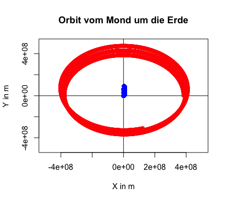
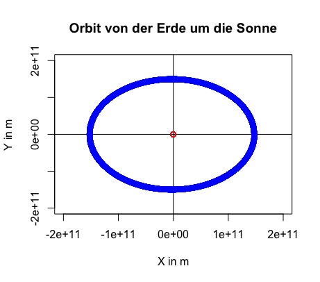
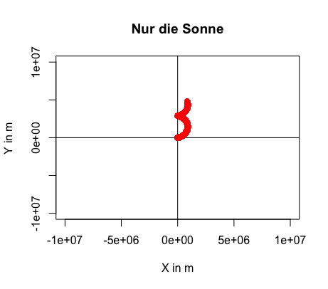

# Überlegungen


## Initiale Überlegungen

Das gewählte Thema fällt unter die numerische Lösen von Differentialgleichungen.
Mein erster Ansatz war nun aber eine Überlegung mit Vektoren in der komplexen Ebene.
Der Bezug in der Wirklichkeit sollte ein Artilleriegeschütz sein, welches mit einem Winkel eingestellt wird 
und dessen Mündungsgeschwindigkeit bekannt wäre.

Das erwies sich als zu schwierig, weil für die Umrechnung von Vektoren in Polarkoordinaten die Sinus und 
Cosinus Funktionen nötig sind. Außerdem gefiel mir die Waffenanalogie nicht, auch wenn die moderne Computertechnik 
dort ihren Anfang genommen hatte.

Somit habe ich mich zurückbesonnen auf die eigentlich zentrale Differentialgleichung die gelöst werden soll.
Ausgehend von Newtons F=m*a wobei a die doppelte Ableitung des Ortes nach der Zeit ist, habe ich mich daran gemacht 
diese erstmal von Hand zu lösen. Mit dem Ergebnis von einem gegebenen:

```
dr(t)/dt = g * t + v_0
r(t) = 1/2 * g * t^2 + v_0 * t +r_0
```

Bei der Umsetzung ins numerische habe ich mich aber andauernd r und v durcheinander gebracht, was zwar zu 
Parabeln geführt hat aber eine Änderung der Ausgangswerte haben unsinnige Kurven ergeben.


## Erste Lösung in 2D

Hilfe fand ich in diesem YouTube Video: https://www.youtube.com/watch?v=IaR1c9_AhKI

Darin fand ich auch Pseudocode, der mir half einen Algorithmus nach dem expliziten Eulerverfahren in Rust zu schreiben.
Die Grundidee ist:

Gegeben:
- Anfangsort r_x_0, r_y_0
- Anfangsgeschwindigkeit: v_x_0, v_y_0
- Schrittweite für die Zeit: d_t
- Gravitation: g_x, g_y (in diesem Fall werden die als Konstant angenommen, auch wenn man sie Ortsabhängig sehen könnte)

Rechnung:
```
r_x_neu = r_x_alt + v_x_alt * d_t
r_y_neu = r_y_alt + v_y_alt * d_t
v_x_neu = v_y_alt + g_x * d_t
v_y_neu = v_y_alt + g_y * d_t (Dabei ist g_y = -9.81)
```
Anschließend werden die alten Werte zu den neuen Werten und der Loop beginnt von vorne.


## 3D Experiment

Die Initialen Überlegungen lassen sich leicht ins Dreidimensionale zu übertragen aber die Kurven lassen sich
schlecht in einem PDF darstellen.
Außerdem ist der es ein Mehraufwand in der Hardware ohne viel theoretische Komplexität.


## Reibung

Mit dem Ansatz von Stokes müssen folgende Änderungen vorgenommen werden.
- Bei der Änderung des Geschwindigkeit muss die Reibungsfomel einbezogen werden
- Formel: F = 6 * pi * Radius Körper * dynamische Viskosität * Geschwindigkeit 
- Dabei werden F_x und F_y separat berechnet und von der aktuellen Geschwindigkeit abgezogen (entgegen)
- Der Radius wird als Kugelförmig angenommen
- Die Viskosität von Luft ist: 18,215 mikro Pascal * Sekunde bzw kg / (m * s) - zumindest bei 20 Grad Celsius
- Die Geschwindigkeit ist ja schon im Algorithmus drin

Quelle für die Viskosiät: https://stoffdaten-online.de/fluide/luft/

Pseudocode:
```
r_neu = ... (wie bisher)
v_x_neu = v_x_alt + (g_x - 6 * 3.142 * Radius * 18.215 * 0.000001 * v_x_alt) * dt;
v_y_neu = v_y_alt + (g_y - 6 * 3.142 * Radius * 18.215 * 0.000001 * v_y_alt) * dt;
```

Die 0.000001 sind nötig um die mikro (10^-6) Pascal * sekunde korrekt darzustellen.

Die Graphen von der Implementierung zeigen, dass mit mehr Initialgeschwindigkeit mehr Reibungsverlust entsteht.


Die Geschwindikeiten über die Zeit zeigen eine interessante Abweichung von Y.


Wenn man noch einen Schritt weiter gehen wöllte, könnte man die Viskosität der Luft von der
Temperatur und der Höhe abhängig machen.


## Orbital Experiment

Weil ich mich eigentlich mehr für Raumfahrt als für Artillerie Geschütze interessiere, wollte ich mich
an Orbitalmechanik mit dem selben Algorithmus versuchen.
Dabei fällt die Reibung natürlich weg aber g ist nicht mehr konstant sondern Ortsabhängig.
Anfangen will ich mit zwei Objekten die umeinander kreisen, wirklich interessant wird es aber erst mit drei 
Objekten, weil dieses Problem sogar nur numerisch lösbar ist und damit genau der Anwendungsfall für diesen Algorithmus.

Der Algorithmus für die Orbitberechnung mit zwei Objekten funktioniert nur fast. Es gibt ein seltsames Problem, bei 
dem der größere, zentrale Körper einen Drift in die Anfangsrichtung des kleineren Körpers bekommt.
Dieses Problem ist mir aufgefallen beim Test mit dem Mond um die Erde.



Mein erster Gedanke war, dass der Masse unterschied zu klein sein könnte, weswegen ich es mit der Erde und der
Sonne nocheinmal versucht habe aber mit dem selben Problem.
Auf dem ersten Bild kann man es wegen der Entfernungen nicht so gut erkennen, aber die Sonne hat den selben Drift. 




Die Erklärung für diesen Fehler kann eigentlich nur im Algorithmus liegen aber die Deadline für die Abgabe kommt 
immer näher.

## Optimierung mit Heun

Momentan verwende ich für alle diese Probleme den selben Algorithmus von Euler. Dieser ist aber wird aber nur linear 
besser, was für kleine Schrittweiten eine lange Rechendauer bedeutet.

Optimal wäre etwas wie das Heun-Verfahren, welches quadratisch besser wird, ohne viel komplizierter in der 
Implementierung zu sein.